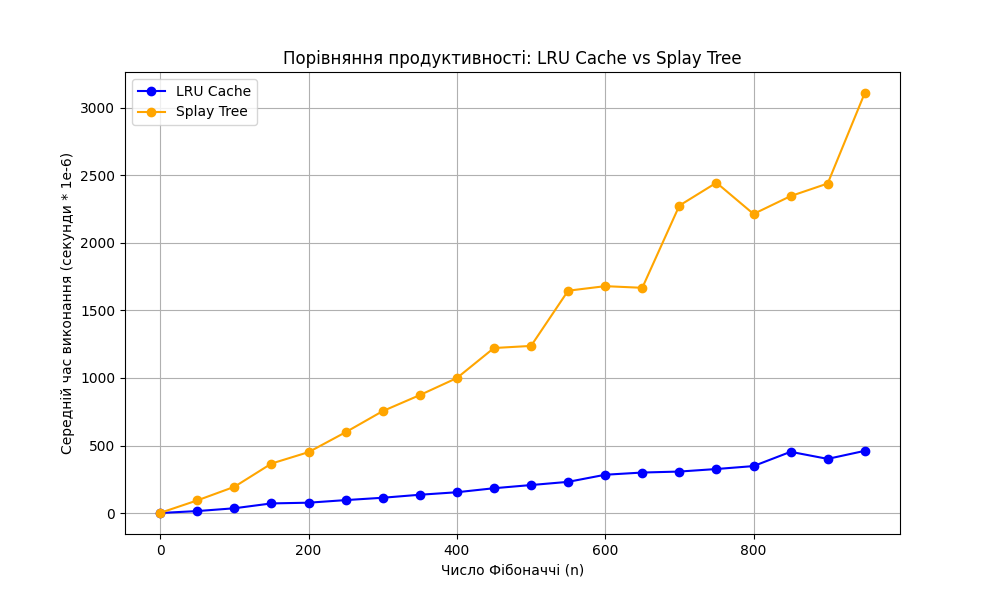

# goit-algo2-hw-07

## Завдання 1. Оптимізація доступу до даних за допомогою LRU-кешу

```bash
python lru_cache.py
```

Результат

Час виконання без кешування: 16.86 секунд
Час виконання з LRU-кешем: 16.27 секунд

## Завдання 2. Порівняння продуктивності обчислення чисел Фібоначчі із використанням LRU-кешу та Splay Tree

```bash
python fibonacci.py
```

Результат

| n   | LRU Cache Time (s) | Splay Tree Time (s) |
| --- | ------------------ | ------------------- |
| 0   | 0.0000007000       | 0.0000018600        |
| 50  | 0.0000150000       | 0.0000941000        |
| 100 | 0.0000357200       | 0.0001945800        |
| 150 | 0.0000716400       | 0.0003666400        |
| 200 | 0.0000770000       | 0.0004511400        |
| 250 | 0.0000961800       | 0.0005986000        |
| 300 | 0.0001135800       | 0.0007548600        |
| 350 | 0.0001358000       | 0.0008733600        |
| 400 | 0.0001543200       | 0.0009996400        |
| 450 | 0.0001840200       | 0.0012218800        |
| 500 | 0.0002076200       | 0.0012374200        |
| 550 | 0.0002312600       | 0.0016461000        |
| 600 | 0.0002838800       | 0.0016798000        |
| 650 | 0.0003002000       | 0.0016675200        |
| 700 | 0.0003074600       | 0.0022761000        |
| 750 | 0.0003262600       | 0.0024455800        |
| 800 | 0.0003479800       | 0.0022140200        |
| 850 | 0.0004536400       | 0.0023464000        |
| 900 | 0.0004012800       | 0.0024395800        |
| 950 | 0.0004607800       | 0.0031095000        |


